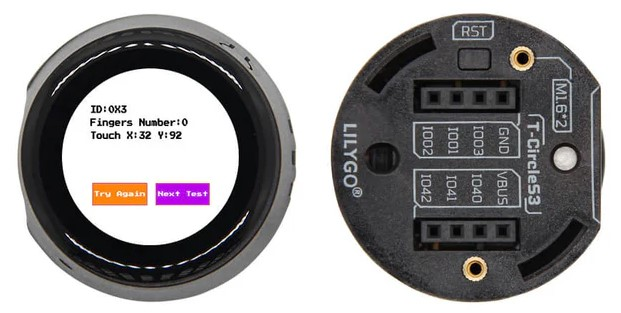
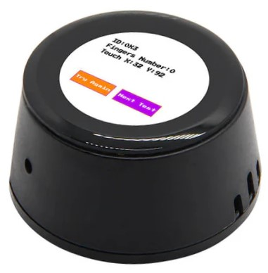
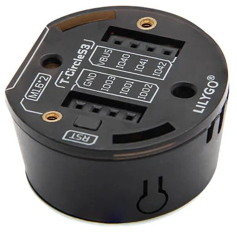
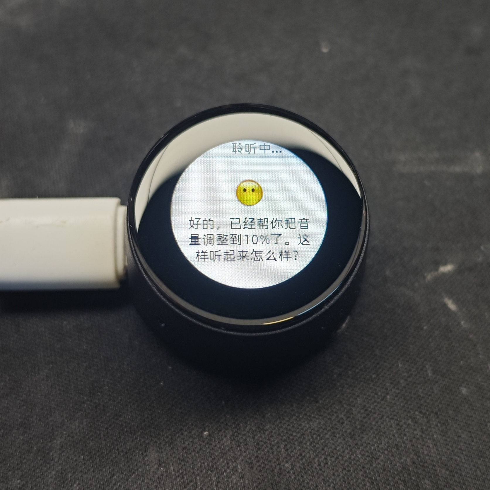

<!--
 * @Description: None
 * @Author: LILYGO_L
 * @Date: 2025-01-02 11:24:39
 * @LastEditTime: 2026-05-15 11:51:49
 * @License: GPL 3.0
-->

<h1 align = "center">T-Circle-S3</h1>

    

## **[English](./README.md) | 中文**

## 版本迭代:
| Version                               | Update date                       |Update description|
| :-------------------------------: | :-------------------------------: |:--------------: |
| T-Circle-S3_V1.0                      | 2024-08-15                    | 初始版本      |
| T-Circle-S3_V1.1                      | 2025-02-14                    |更换麦克风型号    |
| T-Circle-S3-Infrared-Expansion_V1.0                      | 2025-10-25                    |T-Circle-S3红外扩展板    |

## 购买链接

| Product                     | SOC           |  FLASH  |  PSRAM   | Link                   |
| :------------------------: | :-----------: |:-------: | :---------: | :------------------: |
| T-Circle-S3_V1.0-V1.1   | ESP32S3R8 |   16M   | 8M (Octal SPI) |  [LILYGO Mall](https://lilygo.cc/products/t-circle-s3?_pos=1&_sid=6fa6d0d3e&_ss=r)   |
| T-Circle-S3-Infrared-Expansion_V1.0   |  |     | |  [Null]()   |

## 目录
- [描述](#描述)
- [预览](#预览)
- [模块](#模块)
- [软件部署](#软件部署)
- [引脚总览](#引脚总览)
- [相关测试](#相关测试)
- [常见问题](#常见问题)
- [项目](#项目)

## 描述

T-Circle-S3是一款基于ESP32S3开发的板载0.75寸小屏的开发板，配备有扬声器麦克风和三色LED灯，背部有六个可编程输入输出IO口可扩展多种外设。

T-Circle-S3-Infrared-Expansion为T-Circle-S3的红外扩展板，板载有红外线感应器、9轴传感器和电池。

## 预览

### 实物图

    

---

    

---

    

## 模块

### T-Circle-S3 部分

### 1. MCU

* 芯片：ESP32-S3-R8
* PSRAM：8M (Octal SPI) 
* FLASH：16M
* 相关资料：
    >[乐鑫官方ESP32-S3数据手册](https://www.espressif.com.cn/sites/default/files/documentation/esp32-s3_datasheet_en.pdf)

### 2. 屏幕

* 尺寸：0.75英寸LCD圆屏幕
* 分辨率：160x160px
* 屏幕类型：TFT、LCD
* 驱动芯片：GC9D01N
* 总线通信协议：标准SPI
* 相关资料：
    >[GC9D01N](./information/GC9D01N.pdf)  
    >[TFT_eSPI-2.5.43](https://github.com/Bodmer/TFT_eSPI)
* 依赖库：
    >[Arduino_GFX-1.3.7](https://github.com/moononournation/Arduino_GFX)

### 3. 触摸

* 芯片：CST816D
* 总线通信协议：IIC
* 相关资料：
    >[GC9D01N](./information/GC9D01N.pdf)
* 依赖库：
    >[Arduino_DriveBus-1.1.16]()

### 4. 扬声器

* 驱动芯片：MAX98357A
* 使用总线通信协议：IIS
* 相关资料：
    >[MAX98357A](./information/MAX98357AETE+T.pdf)
* 依赖库：
    >[Arduino_DriveBus-1.1.16]()  
    >[ESP32-audioI2S-3.0.6](https://github.com/schreibfaul1/ESP32-audioI2S)

### 5. 麦克风

> #### T-Circle-S3_V1.0 版本
> * 芯片：MSM261S4030H0R
> * 总线通信协议：IIS
> * 相关资料：
>    >[MSM261S4030H0R](./information/MSM261S4030H0R.pdf)
> * 依赖库：
>     >[Arduino_DriveBus-1.1.16]()
>     >[DFRobot_MSM261](https://github.com/DFRobot/DFrobot_MSM261)

> #### T-Circle-S3_V1.1 版本
> * 芯片：MP34DT05-A
> * 总线通信协议：PDM
> * 相关资料：
>    >[MP34DT05-A](./information/mp34dt05-a.pdf)
> * 依赖库：
>    >[Arduino_DriveBus-1.1.16]()

### 6. LED灯

* 芯片：APA102
* 相关资料：
    >[APA102_2020_LED](./information/APA102_2020_LED.pdf)
* 依赖库：
    >[FastLED-3.6.0](https://github.com/FastLED/FastLED)

### T-Circle-S3-Infrared-Expansion 部分

### 1. 红外模块

* 芯片：TSOP75338TR
* 总线通信协议：RMT
* 相关资料：
    >[TSOP75338TR](./information/TSOP75338TR.pdf)
* 依赖库：
    >[IRremoteESP8266](https://github.com/crankyoldgit/IRremoteESP8266)

### 2. IMU

* 芯片：ICM20948
* 总线通信协议：IIC
* 相关资料：
    >[ICM20948](./information/ICM20948.pdf)
* 依赖库：
    >[ICM20948_WE](https://github.com/wollewald/ICM20948_WE)

## 快速开始

### 示例支持

#### T-Circle-S3 示例
| Example | `[Platformio IDE][espressif32-v6.5.0]` `[Arduino IDE][esp32_v2.0.14]` | `[ESP-IDF][esp-idf-V4.4.8]`| `[ESP-IDF][esp-idf-V5.3.2]`| Description | Picture |
| ------  | ------  | ------ | ------ | ------ | ------ | 
| [Animated_Eyes_1](./examples/Animated_Eyes_1) |  
![alt text][supported] | || |  |
| [APA102_Blink](./examples/APA102_Blink) | 
![alt text][supported] | | ||  |
| [CST816D](./examples/CST816D) | 
![alt text][supported] |  |  |
| [DMIC_ReadData](./examples/DMIC_ReadData) | 
![alt text][supported] | || |  |
| [DMIC_ReadData](./examples/DMIC_ReadData) | 
![alt text][supported] | || |  |
| [GFX](./examples/GFX) | 
![alt text][supported] |  |  |
| [GFX_CST816D_Image](./examples/GFX_CST816D_Image) | 
![alt text][supported] | | ||  |
| [GFX_Wifi_AP_Contract](./examples/GFX_Wifi_AP_Contract) | 
![alt text][supported] | || |  |
| [GFX_Wifi_STA_Contract](./examples/GFX_Wifi_STA_Contract) | 
![alt text][supported] | || |  |
| [IIC_Scan_2](./examples/IIC_Scan_2) | 
![alt text][supported] | | ||  |
| [Original_Test](./examples/Original_Test) | 
![alt text][supported] ||| 出厂初始测试文件 |  |
| [TFT](./examples/TFT) | 
![alt text][supported] | || |  |
| [Voice_Speaker](./examples/Voice_Speaker) | 
![alt text][supported] |  ||  |  |
| [Voice_Speaker_APA102](./examples/Voice_Speaker_APA102) | 
![alt text][supported] | ||  |  |
| [Wifi_Music](./examples/Wifi_Music) | 
![alt text][supported] | ||  |  |
| [lilygo_s3_apps](https://github.com/Xinyuan-LilyGO/T-Circle-S3/tree/esp-idf-V4.4.8/examples/lilygo_s3_apps) | | 
![alt text][supported] || 该示例为语音控制示例，由Grovety提供，以下是原始链接:   [Grovety lilygo_s3_apps](https://github.com/Grovety/lilygo_s3_apps)| 
  
 |
| [XiaoZhi_AI_Chatbot](https://github.com/78/xiaozhi-esp32?tab=readme-ov-file) | || 
![alt text][supported] | 该示例为小智AI示例，由Xiaoxia提供| 
  
 |

#### T-Circle-S3-Infrared-Expansion 示例
| Example | `[Platformio IDE][espressif32-v6.5.0]` `[Arduino IDE][esp32_v2.0.14]` | `[ESP-IDF][esp-idf-V4.4.8]`| `[ESP-IDF][esp-idf-V5.3.2]`| Description | Picture |
| ------  | ------  | ------ | ------ | ------ | ------ | 
| [RMT](./examples/RMT) |  
![alt text][supported] | || |  |
| [ICM20948](./examples/ICM20948) | 
![alt text][supported] | | ||  |

[supported]: https://img.shields.io/badge/-supported-green "example"

| Firmware | Description | Picture |
| ------  | ------  | ------ |
| [Original_Test(T-Circle-S3_V1.0)](./firmware/[T-Circle-S3_V1.0][Original_Test]_firmware_V1.0.1.bin) | 出厂程序 |  |
| [Original_Test(T-Circle-S3_V1.1)](./firmware/（V1.1版本修改麦克风型号）[T-Circle-S3_V1.1][Original_Test]_firmware_202502141426.bin) | 出厂程序 |  |
| [GFX_Wifi_AP_Contract](./firmware/[T-Circle-S3_V1.0] [GFX_Wifi_AP_Contract]_firmware_V1.0.0) | 初始版本 |  |
| [GFX_Wifi_STA_Contract](./firmware/[T-Circle-S3_V1.0][GFX_Wifi_STA_Contract]_firmware_V1.0.0) | 初始版本 |  |
| [lilygo_s3_apps](./firmware/[T-Circle-S3_V1.0]_[lilygo_s3_apps]_firmware_V1.0.0.bin) | 初始版本 |  |
| [xiaozhi_esp32](./firmware/[T-Circle-S3_V1.0][xiaozhi-esp32_V1.0.1]_firmware_202501240943.bin) | |  |
| [Original_Test(T_Circle_S3_Infrared_Expansion)](./firmware/[T-Circle-S3_V1.0][T_Circle_S3_Infrared_Expansion_V1.0][Original_Test]_firmware_202506091350.bin) | |  |

### PlatformIO
1. 安装[VisualStudioCode](https://code.visualstudio.com/Download)，根据你的系统类型选择安装。

2. 打开VisualStudioCode软件侧边栏的“扩展”（或者使用<kbd>Ctrl</kbd>+<kbd>Shift</kbd>+<kbd>X</kbd>打开扩展），搜索“PlatformIO IDE”扩展并下载。

3. 在安装扩展的期间，你可以前往GitHub下载程序，你可以通过点击带绿色字样的“<> Code”下载主分支程序，也通过侧边栏下载“Releases”版本程序。

4. 扩展安装完成后，打开侧边栏的资源管理器（或者使用<kbd>Ctrl</kbd>+<kbd>Shift</kbd>+<kbd>E</kbd>打开），点击“打开文件夹”，找到刚刚你下载的项目代码（整个文件夹），点击“添加”，此时项目文件就添加到你的工作区了。

5. 打开项目文件中的“platformio.ini”（添加文件夹成功后PlatformIO会自动打开对应文件夹的“platformio.ini”）,在“[platformio]”目录下取消注释选择你需要烧录的示例程序（以“default_envs = xxx”为标头），然后点击左下角的“<kbd>[√](image/4.png)</kbd>”进行编译，如果编译无误，将单片机连接电脑，点击左下角“<kbd>[→](image/5.png)</kbd>”即可进行烧录。

### Arduino
1. 安装[Arduino](https://www.arduino.cc/en/software)，根据你的系统类型选择安装。

2. 打开项目文件夹的“example”目录，选择示例项目文件夹，打开以“.ino”结尾的文件即可打开Arduino IDE项目工作区。

3. 打开右上角“工具”菜单栏->选择“开发板”->“开发板管理器”，找到或者搜索“esp32”，下载作者名为“Espressif Systems”的开发板文件。接着返回“开发板”菜单栏，选择“ESP32 Arduino”开发板下的开发板类型，选择的开发板类型由“platformio.ini”文件中以[env]目录下的“board = xxx”标头为准，如果没有对应的开发板，则需要自己手动添加项目文件夹下“board”目录下的开发板。

4. 打开菜单栏“[文件](image/6.png)”->“[首选项](image/6.png)”，找到“[项目文件夹位置](image/7.png)”这一栏，将项目目录下的“libraries”文件夹里的所有库文件连带文件夹复制粘贴到这个目录下的“libraries”里边。

5. 在 "工具 "菜单中选择正确的设置，如下表所示。

#### ESP32-S3
| Setting                               | Value                                 |
| :-------------------------------: | :-------------------------------: |
| Board                                 | ESP32S3 Dev Module           |
| Upload Speed                     | 921600                               |
| USB Mode                           | Hardware CDC and JTAG     |
| USB CDC On Boot                | Enabled                              |
| USB Firmware MSC On Boot | Disabled                             |
| USB DFU On Boot                | Disabled                             |
| CPU Frequency                   | 240MHz (WiFi)                    |
| Flash Mode                         | QIO 80MHz                         |
| Flash Size                           | 16MB (128Mb)                    |
| Core Debug Level                | None                                 |
| Partition Scheme                | 16M Flash (3MB APP/9.9MB FATFS) |
| PSRAM                                | OPI PSRAM                         |
| Arduino Runs On                  | Core 1                               |
| Events Run On                     | Core 1                               |        

6. 选择正确的端口。

7. 点击右上角“<kbd>[√](image/8.png)</kbd>”进行编译，如果编译无误，将单片机连接电脑，点击右上角“<kbd>[→](image/9.png)</kbd>”即可进行烧录。

### firmware烧录
1. 打开项目文件“tools”找到ESP32烧录工具，打开。

2. 选择正确的烧录芯片以及烧录方式点击“OK”，如图所示根据步骤1->2->3->4->5即可烧录程序，如果烧录不成功，请按住“BOOT-0”键再下载烧录。

3. 烧录文件在项目文件根目录“[firmware](./firmware/)”文件下，里面有对firmware文件版本的说明，选择合适的版本下载即可。

    
    

## 引脚总览

引脚定义请参考配置文件：
 

[pin_config.h](./libraries/Mylibrary/pin_config.h)  

## 相关测试

## 常见问题

* Q. 看了以上教程我还是不会搭建编程环境怎么办？
* A. 如果看了以上教程还不懂如何搭建环境的可以参考[LilyGo-Document](https://github.com/Xinyuan-LilyGO/LilyGo-Document)文档说明来搭建。

 

* Q. 为什么打开Arduino IDE时他会提醒我是否要升级库文件？我应该升级还是不升级？
* A. 选择不升级库文件，不同版本的库文件可能不会相互兼容所以不建议升级库文件。

 

* Q. 为什么我的板子上“Uart”接口没有输出串口数据，是不是坏了用不了啊？
* A. 因为项目文件默认配置将USB接口作为Uart0串口输出作为调试，“Uart”接口连接的是Uart0，不经配置自然是不会输出任何数据的。 PlatformIO用户请打开项目文件“platformio.ini”，将“build_flags = xxx”下的选项“-DARDUINO_USB_CDC_ON_BOOT=true”修改成“-DARDUINO_USB_CDC_ON_BOOT=false”即可正常使用外部“Uart”接口。 Arduino用户打开菜单“工具”栏，选择USB CDC On Boot: “Disabled”即可正常使用外部“Uart”接口。

 

* Q. 为什么我的板子一直烧录失败呢？
* A. 请按住“BOOT-0”按键重新下载程序。

## 项目
* [T-Circle-S3_V1.0](./project/T-Circle-S3_V1.0.pdf)
* [T-Circle-S3_V1.1](./project/T-Circle-S3_V1.1.pdf)
* [T-Circle-S3-Infrared-Expansion_V1.0](./project/T-Circle-S3-Infrared-Expansion_V1.0.pdf)
